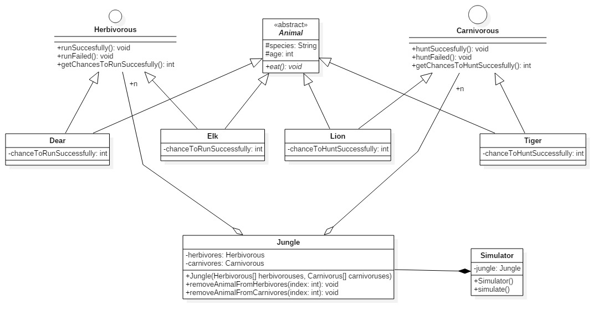

# Implement the following exercises

In this lab you will create small Java applications by using as reference an UML class diagram. Please consider following general notes before start implementing:
- toString() method when required will return a string like *ClassName{attributeName1=attributeValue1,...,attributeNamen=attributeValuen}*.
- Do not reuse (import) the same class in multiple exercises. **Each exercise is standalone and should be resolved in its package.**

## Exercise 1


Given the UML class diagram above, implement the corresponding Java program.

1. Create Java class based on the diagram above. 
    * _insertCard()_ method from ATM will compare received pin with the pin stored in card. If 2 pins match the card will be stored as attribute and will be used for executign transactions.
    * _removeCard()_ method will _invalidate_ a previously inserted card by making the attribute null. 
2. Demonstrate the functionality of application in Exercise1 class main method.
3. Create minimal unit tests for testing the behavior of the programm.

**Note 1: Constructors and setter\getter methods are not represented in the diagram but can\should be implemented."**

**Note 2: You can add any suplimentary methods if required.**


## Exercise 2

Create an UML Use-Case diagram describing an ATM system. Save jpg use case diagram in /docs subfolder and display it in this readme file bellow.

**>>>>insert use case diagram here<<<<**

## Exercise 3

```java
interface Playable {
    void play();
}

class ColorVideo implements Playable {

    private String fileName;

    public ColorVideo(String fileName){
        this.fileName = fileName;
        loadFromDisk(fileName);
    }

    @Override
    public void play() {
        System.out.println("Play " + fileName);
    }

    private void loadFromDisk(String fileName){
        System.out.println("Loading video..." + fileName);
    }
}

class ProxyVideo implements Playable {

    private ColorVideo video;
    private String fileName;

    public ProxyVideo(String fileName){
        this.fileName = fileName;
    }

    @Override
    public void play() {
        if(video == null){
            video = new ColorVideo(fileName);
        }
        video.play();
    }
}
```

For the application above:
* create UML class diagram and display it bellow.
* add a new class _BlakAndWhiteVideo_ which will display message "Play black and white video {name of the video}".
* add necessary changes in ProxyVideo class so that depending on a constructor argument given in this class the proxy to call either black and white or color playable video.

**>>>>insert class diagram here<<<<**

## Exercise 5


Given the UML class diagram above, implement the corresponding Java program. 

1. Create Java class based on the diagram above. 
<br>After the creation of each Animal call the method eat which prints a message with the meal of each animal
<br>The attributes chanceTo* will take values in [0-100]
<br>The implementation of methods run*/hunt* from interfaces will print a message like: 
<br>${Animal} ${animal.name} hunt/run successfully/failed at age ${animal.age} with a chance of  ${animal.chanceToHuntSuccessfully}%
<br>ex: Dear dearName run successfully at age 13 with a chance of 88%
<br>The Simulator() will create the Jungle which contains 20 herbivores(random nr of Elk/Dear) and 20 carnivores(random nr of Lion/Tiger) 
<br>The simulate() method will take random a herbivore and a carnivore from the jungle and will simulate a "fight" until there are only herbivores or only carnivores or is a draw.
<br>After each duel the looser will be removed from jungle. In the end print a message with the winners if is not a draw
<br>A draw happens when carnivores have their best participant equal in chances with the best participant from herbivores
<br>ex: Tiger{chanceToHuntSuccessfully=98, name='16', age=48} and Dear{chanceToRunSuccessfully=98, name='1', age=3}
<br>Feel free to add any methods you need
2. Call the simulate method in Exercise1 main method
3. Create a minimal unit test for testing the behavior of the created class.